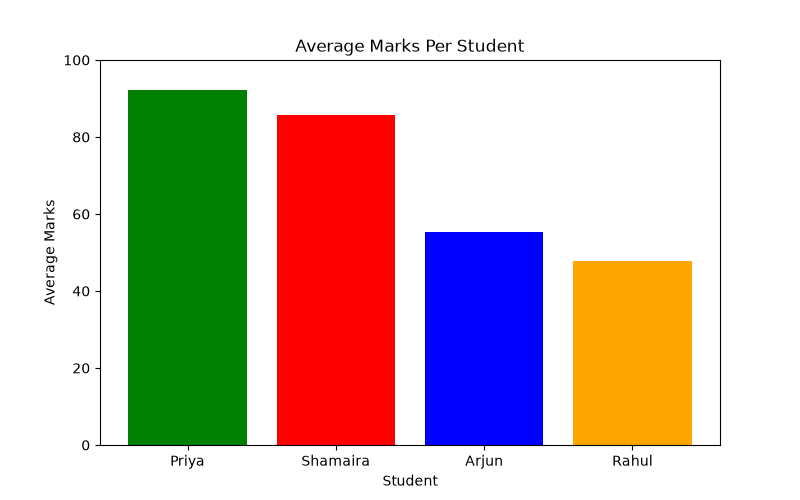

# Student Grade Analyzer

A Python project that stores student marks in a SQLite database, performs SQL-based analysis, and generates visual reports using Pandas and Matplotlib.

## Tech Stack

* Python 3
* SQLite
* Pandas
* Matplotlib

## Features

* Store student marks in a SQLite database
* Calculate average marks per student
* Identify toppers in each subject
* Find students who failed any subject
* Generate visual reports using Matplotlib

## Project Structure

```text
student-grade-analyzer/
│
├── data/
│   ├── students.db
│   └── report.png
│
├── setup_db.py
├── analyze.py
├── report.py
├── requirements.txt
└── README.md
```

## How to Run

### Install dependencies

```bash
pip install -r requirements.txt
```

### Run the project

```bash
python setup_db.py
python analyze.py
python report.py
```

## 📈 Analysis Performed

* Average marks per student
* Topper in each subject
* Students who failed any subject

### Example Output

```text
=== Topper Per Subject ===
   subject   name  top_marks
0    Maths  Priya         92
1  Physics  Priya         88
2   Python  Priya         97

=== Failed Students ===
    name  subject  marks
0  Rahul  Physics     38
```

## Sample Report



## SQL Concepts Used

* SELECT
* WHERE
* GROUP BY
* AVG()
* MAX()
* ORDER BY

## Learning Outcomes

This project demonstrates:

* Database management with SQLite
* SQL querying and data analysis
* Data processing using Pandas
* Data visualization using Matplotlib
* Version control using Git and GitHub

```
```
